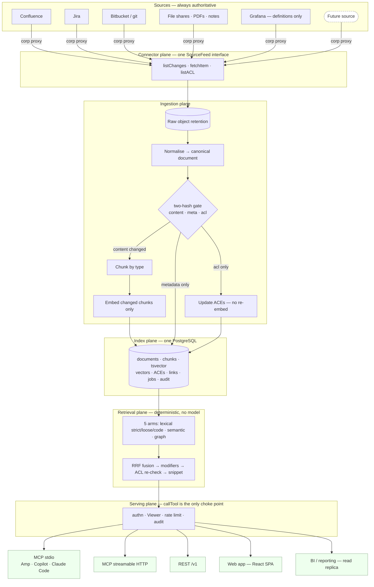

# 13 — System diagram and technology stack

Three questions answered here:

1. What does the whole system look like on one page?
2. What is each box actually built from, and what is the fallback when the
   first choice is blocked?
3. Where are the two seams — **adding a source** and **building on the index** —
   and how much work does each cost once they exist?

The seams are the point. A platform whose value is "many sources in, many
consumers out" is judged by the cost of the next source and the next consumer,
not by the elegance of the first.

---

## 1. The whole system

```
 ╔══════════════════════════════════════════════════════════════════════════════╗
 ║  SOURCES                          (systems of record — always authoritative) ║
 ╠══════════════════════════════════════════════════════════════════════════════╣
 ║ Confluence   Jira   Bitbucket   SharePoint/   PDFs &   Grafana     Future:   ║
 ║   REST       REST    git+REST    file shares   notes   dashboards  ServiceNow║
 ║                                                        (defs only)  Slack…   ║
 ╚════╤═══════════╤═══════╤═══════════╤═══════════╤══════════╤═════════════╤════╝
      │           │       │           │           │          │             │
      └───────────┴───────┴─────┬─────┴───────────┴──────────┴─────────────┘
                                │   all egress via undici ProxyAgent (corp proxy)
 ╔══════════════════════════════▼═══════════════════════════════════════════════╗
 ║  CONNECTOR PLANE          one interface: SourceFeed                          ║
 ║  listChanges(scope,cursor) · fetchItem(id) · listACL(scope) · resolveGroups  ║
 ║  owns: pagination · rate limit · retry/backoff · credentials · proxy         ║
 ║  knows nothing about: chunking · embedding · ranking                         ║
 ╚══════════════════════════════╤═══════════════════════════════════════════════╝
                                │  ChangeItem{externalId, version, hashes, acl}
 ╔══════════════════════════════▼═══════════════════════════════════════════════╗
 ║  INGESTION PLANE                                    two lanes, one worker    ║
 ║                                                                              ║
 ║   ┌── backfill lane ──┐   ┌── delta lane (5 min) ──┐                         ║
 ║   │ bounded, off-peak │   │ small, latency-bound   │   never starve delta    ║
 ║   └─────────┬─────────┘   └───────────┬────────────┘                         ║
 ║             └──────────┬──────────────┘                                      ║
 ║                        ▼                                                     ║
 ║   raw retain ─► normalise ─► two-hash gate ─► chunk ─► enrich ─► embed        ║
 ║   (object store)  canonical    ┌──────────┴──────────┐  secrets   ONNX/MaaS   ║
 ║                    document    │ content│meta│acl    │  classify  changed     ║
 ║                                └────┬───┴──┬─┴───┬───┘            chunks only ║
 ║                          re-chunk ◄─┘      │     └─► ACE update, no re-embed  ║
 ║                                     metadata only: keep chunks + vectors      ║
 ╚══════════════════════════════╤═══════════════════════════════════════════════╝
                                │  idempotent on (tenant, doc_id, version)
 ╔══════════════════════════════▼═══════════════════════════════════════════════╗
 ║  INDEX PLANE — one PostgreSQL                                                ║
 ║                                                                              ║
 ║  documents   chunks      chunk_vectors   document_aces   links     jobs       ║
 ║  ─────────   ──────      ─────────────   ────────────    ─────     ────       ║
 ║  source      body        float4[384]     ALLOW/DENY      typed     SKIP       ║
 ║  container▲  tsvector    binary sig      deny-wins       edges     LOCKED     ║
 ║  hashes     (GIN)        IVF lists       principal                 fenced     ║
 ║  tiers       code-tsv                                              leases     ║
 ║  valid_from/to                                                               ║
 ║                                                                              ║
 ║  cursors · principals cache · audit_log · eval_runs                          ║
 ║  ▲ container is an indexed column, not jsonb — it is the ACL pre-filter       ║
 ╚══════════════════════════════╤═══════════════════════════════════════════════╝
                                │  every query already ACL-filtered in SQL
 ╔══════════════════════════════▼═══════════════════════════════════════════════╗
 ║  RETRIEVAL PLANE          stateless · deterministic · no model in the path    ║
 ║                                                                              ║
 ║   query ─► classify ─┬─ arm1 lexical strict ─┐                               ║
 ║                      ├─ arm2 lexical loose   │                               ║
 ║                      ├─ arm3 code lexical    ├─► RRF ─► modifiers ─► ACL     ║
 ║                      ├─ arm4 semantic        │   (rank-based:      re-check  ║
 ║                      └─ arm5 graph expand ───┘    no cross-source     │      ║
 ║                                                   score norm)         ▼      ║
 ║                                          source-diversity cap ─► snippet     ║
 ╚══════════════════════════════╤═══════════════════════════════════════════════╝
 ╔══════════════════════════════▼═══════════════════════════════════════════════╗
 ║  SERVING PLANE       callTool(name, args, viewer, db)  ← the ONLY choke point ║
 ║  authn (OIDC) · Viewer derived never supplied · rate limit · audit row/read   ║
 ╚══╤════════════╤═════════════╤═══════════════╤═══════════════╤════════════════╝
    │            │             │               │               │
 ┌──▼───┐  ┌─────▼──────┐  ┌───▼────┐  ┌───────▼──────┐  ┌─────▼──────────┐
 │ MCP  │  │ MCP HTTP   │  │ REST   │  │ Web app      │  │ BI / reporting │
 │stdio │  │ (platform) │  │ /v1/*  │  │ React SPA    │  │ read replica   │
 │Amp,  │  │ shared     │  │ any    │  │ served by    │  │ rpt.* views    │
 │Copilot│ │ service    │  │ client │  │ the API proc │  │ aggregate-only │
 └──────┘  └────────────┘  └────────┘  └──────────────┘  └────────────────┘

  ┌─────────────────────────────────────────────────────────────────────────┐
  │ GOVERNANCE  ACL sync (tighter SLA than content) · secret quarantine ·   │
  │             classification · retention · purge · audit                  │
  ├─────────────────────────────────────────────────────────────────────────┤
  │ EVALUATION  golden queries · scored runs · CI regression gate on ranking │
  └─────────────────────────────────────────────────────────────────────────┘
```

### 1.1 Mermaid (renders on the GitHub PR page)



---

## 2. Querying across sources

The thing that makes cross-source query work is a schema decision, not a query
trick: **one `documents` table with a `source` column**, not a table per source.

| | One table, `source` column | Table per source |
|---|---|---|
| Cross-source query | One plan, one index scan | `UNION ALL` of N plans |
| Ranking across sources | Direct | Requires score normalisation |
| New source | Insert rows | New table, new query arm, new migration |
| Per-source filter | `WHERE source = …` | Free, but it is the only thing that is |

The `UNION` variant fails specifically at ranking. A BM25 score from a Jira
table and a BM25 score from a Confluence table are **not comparable** — they are
computed against different corpus statistics. Normalising them is a research
problem people rediscover the hard way.

**RRF sidesteps this entirely**, which is the second reason it is the fusion
choice: it consumes *ranks*, not scores. Position 3 in the Jira arm and position
3 in the Confluence arm contribute identically, regardless of what the
underlying scores were. Cross-source fusion becomes arithmetic instead of
calibration.

**Source-diversity cap.** One guard is needed: without it a chatty source wins
by volume. Jira comments are numerous, short and topically repetitive — a query
about a subsystem can return ten comments from the same epic and zero of the
design page that actually answers it. Cap contributions per source (and per
container) before the final cut, then backfill from the next source down. The
cap is a product decision, not a ranking one: it is the difference between "ten
results" and "ten *different* results".

**Cross-source joins are the actual payoff.** The link graph is what makes this
more than parallel search: a Jira key mentioned in a commit message, a
Confluence page linked from a ticket, a code path referenced in a runbook. One
query hits all three planes and `expand` walks between them. That is a question
no single source's own search can answer, and it is the clearest demonstration
of why the index exists.

---

## 3. Technology stack

Chosen against three constraints that dominate every conventional answer:
**corporate proxy**, **no unauthorised software installation**, **LLM access is
Amp / Copilot / a beta HTTP endpoint**. Every row carries its fallback, because
a stack with no fallback for the no-install constraint is a stack that stops at
week one.

### 3.1 Core

| Concern | Choice | Why | Fallback if blocked |
|---|---|---|---|
| Language / runtime | **TypeScript on Node 22 LTS** | One language across connectors, workers, retrieval, MCP and web. The MCP ecosystem is TS-first. Critically, the hard dependencies all have **WASM builds** — no compilation, no platform binaries | Python is the better ML ecosystem and the worse fit here: a second language, a weaker MCP stdio story, and native wheels that hit the same install wall |
| Package manager | **pnpm** workspaces, monorepo | Content-addressed store, strict hoisting, one lockfile. Registry pointed at the internal mirror via `.npmrc` | npm workspaces — same layout, slower installs |
| Database | **PostgreSQL 16**, org-provisioned + read replicas | Catalog, chunks, both lexical indexes, vectors, link graph, ACL graph, job queue and audit in one transactional store. → ADR-0002 | PGlite (WASM Postgres, in `node_modules`) for personal mode — same SQL, same schema |
| Extensions | **None required.** `pgvector` and `pg_trgm` used opportunistically | The design must survive a DBA saying no. Vectors as `float4[]` with an IVF-style funnel; if `pgvector` appears, HNSW replaces the funnel and nothing above it changes | — (this *is* the fallback) |
| Migrations | **Plain SQL files + ~100-line runner** | The schema is the product. No ORM, because an ORM is the mechanism by which the ACL predicate eventually gets omitted from one query | — |
| DB driver | **`pg`** with an explicit pool | Boring, stable, direct SQL. Pool sized against `max_connections` ÷ workers | `postgres.js` if pipelining ever matters |
| Job queue | **Postgres table**, `FOR UPDATE SKIP LOCKED`, fenced leases | At ~0.6 writes/second a broker is a system to get approved for no benefit. Revisit above ~10M jobs/day — three orders of magnitude away | Kafka/SQS only when measurement demands it |
| Raw retention | **S3-compatible object store** if one exists; else content-addressed filesystem tier | Reprocessing without re-crawling. Re-chunking a corpus must not mean asking Confluence for 2M pages again | Postgres large objects — works, poor ergonomics |

### 3.2 Ingestion

| Concern | Choice | Why | Fallback |
|---|---|---|---|
| HTTP egress | **`undici`** + `ProxyAgent` as **global dispatcher** | Node's `fetch` silently ignores `HTTPS_PROXY`. Internal hosts work, proxied hosts hang to timeout, and it reads as "the source is slow". This is a one-line fix and a week-long bug. → ADR-0009 | `NO_PROXY` parsing must be explicit; the default is not what you expect |
| Code parsing | **`web-tree-sitter`** (WASM) + per-language `.wasm` grammars | Real symbol boundaries — function, class, method — with no native compilation. Chunk a function as a function, not as a 500-token window | Line-window chunking with fidelity labelled in results |
| Symbols / references | **SCIP/LSIF** indexes where the org already generates them; tree-sitter-derived otherwise | Reuse what CI already produces; do not re-run compilers. Fidelity varies by language — label it, never hide it | tree-sitter definitions only, no cross-file references |
| PDF | **`pdfjs-dist`** | Pure JS/WASM, no binaries, preserves page coordinates for citations | — |
| Office docs | **`mammoth`** (docx) · **`exceljs`** (xlsx) · `officeparser` (pptx) | All pure JS | Skip and log; unsupported types are quarantined, not silently dropped |
| Embeddings | **`bge-small-en-v1.5`, 384-dim, ONNX, in-process** | 384 dims is a deliberate storage decision: 20M chunks × 384 × 4B ≈ 30 GB, versus ~80 GB at 1024. Runs local, no per-token cost, no rate limit, deterministic. → ADR-0005 | **`onnxruntime-web` (WASM)** if `onnxruntime-node`'s binary download is blocked — slower, lengthens backfill, does not change the design |
| Model access | **`Embedder` interface**, two implementations: local ONNX and the MaaS HTTP endpoint | The beta endpoint is a capability, not a dependency. Swapping is config; the index records which model produced each vector | Index aliasing handles model migration without a full-corpus stall |
| Secret detection | **`gitleaks`-style regex ruleset, in-process** | Runs before anything becomes searchable. A secret indexed is a secret distributed to everyone with search | Entropy heuristics only |

### 3.3 Serving

| Concern | Choice | Why | Fallback |
|---|---|---|---|
| MCP | **`@modelcontextprotocol/sdk`** — stdio *and* streamable HTTP | stdio is phase 0 and needs no infrastructure or security review. HTTP is platform mode. Same tool definitions, same `callTool` | — |
| HTTP API | **Fastify 5** + **`zod`** schemas | Fast, schema-first, small surface. Zod schemas generate both request validation and the MCP tool definitions — one definition, two front doors | Express works; you write more validation by hand |
| Identity | **OIDC bearer, verified with `jose`** against the corp IdP JWKS | The `Viewer` is derived from verified claims and **never** from a request parameter. In platform mode the local-viewer constructor must not exist in the code path | — |
| Web app | **React + Vite SPA**, static bundle **served by the API process** | It is a search box, a filter rail and a result list. SSR buys nothing internally, and a static bundle from the API process removes an entire hosting and deployment decision — which behind a corp proxy is worth more than any framework feature | Next.js if the app grows server-rendered surfaces; the API contract does not change |
| UI | **Tailwind + Radix primitives** | Unopinionated, no design-system lock-in, keeps the choice reversible | Any component kit — the SPA is a thin client |
| Reporting | **Read replicas** + purpose-built `rpt.*` SQL views | Aggregate, scheduled, high-volume — the opposite shape to search. Never on the primary | Materialised views per audience if drill-through is required |
| Observability | **`pino`** JSON logs · **OpenTelemetry** → org collector · `/metrics` Prometheus | The org already runs Grafana. Emit to what exists rather than bringing a stack | — |
| Testing | **`vitest`** + a first-class **ACL red-team suite** | The ACL suite is not a test folder, it is the gate to platform mode. It must fail loudly when a new retrieval arm forgets the predicate | — |

### 3.4 Deliberately not chosen

| Not used | Why not | When to revisit |
|---|---|---|
| **Elasticsearch / OpenSearch** | A second stateful system, a second permission model, and a reconciliation problem discovered by users. Postgres FTS is sufficient at ~2M docs | If lexical latency is measured as the bottleneck and Postgres tuning is exhausted |
| **A dedicated vector DB** | Splits vectors from the ACLs and metadata they must be filtered by. You then denormalise permissions into the vector store (drift) or two-phase (recall loss) | If the corpus grows ~10× and the funnel stops meeting latency |
| **Zoekt for code search** | Genuinely the best answer for regex and substring code queries — and a **Go binary**, which is precisely the installation the constraint forbids. Postgres `pg_trgm` plus an identifier-aware tokenizer covers most of it | If the org will run it as an approved service. Then it becomes arm 3 and nothing else changes |
| **Kafka / a message broker** | 0.6 writes/second. `SKIP LOCKED` is a correct queue at this volume and one fewer approval | Above ~10M jobs/day |
| **LangChain / LlamaIndex** | Abstracts exactly the layer that must be explicit here — chunking, retrieval, and the ACL predicate. The abstraction cost is paid where the requirements are strictest | Never for the retrieval path; fine in a consumer |
| **An LLM in the retrieval path** | Nondeterminism makes ranking unevaluatable, uncacheable and undebuggable, and adds latency and cost to every query | Optional cross-encoder rerank of top 50, off by default, gated on evaluation |

---

## 4. Seam one — adding a source

Cost of a new source, once the contract exists: **one directory, four
functions**. Everything downstream is free.

```
packages/connectors/<source>/
  feed.ts       listChanges · fetchItem · listACL · resolveGroups
  normalise.ts  source payload  →  canonical document
  chunk.ts      chunker selection (prose | code | tabular | slide) — usually a re-export
  config.ts     scopes, cursor semantics, rate limits, proxy hosts
```

```ts
interface SourceFeed {
  listChanges(scope: Scope, cursor: Cursor): AsyncIterable<ChangeItem>
  fetchItem(externalId: string): Promise<RawItem>
  listACL(scope: Scope): AsyncIterable<Ace>          // separate from content, always
  resolveGroups?(principal: string): Promise<string[]>
}
```

What the source **does not** implement, and therefore cannot get wrong: delta
detection, hashing, idempotency, embedding, ACL enforcement, ranking, audit,
tool exposure, staleness reporting. Those live once, above the seam.

Four properties a candidate source must have — worth checking **before**
committing to it, because a source lacking them is a research project, not a
connector:

1. A **stable identifier** per item that survives rename and move.
2. A **monotonic cursor** — an `updated >= X` query or a change feed.
3. **Permissions readable independently of content**, or the two-hash gate
   cannot do its job.
4. **Deletion detectable**, by tombstone or by reconciliation sweep.

Slack has 1, 2 and 4 but a genuinely hard 3. SharePoint has all four. A wiki
export dump has none, and should be treated as a file-share source instead of
pretending to be a live one.

---

## 5. Seam two — building on the index

Every consumer is a client of `callTool`. None of them brings its own
connectors, index, permission model or audit trail — that is the entire return
on centralising.

| Build | Uses | New backend work |
|---|---|---|
| Ask-anything agent (Amp/Copilot) | `search_docs`, `get_doc`, `expand` | **None** — MCP stdio, already exists |
| Team search web app | `POST /v1/search`, `GET /v1/doc/:id` | **None** — SPA against the REST adapter |
| Onboarding assistant | `search_docs` scoped to a container, curated tier weighted | Config only |
| Incident context | `search_docs` + `expand` + **live** log/Grafana MCP tools | None — index finds the runbook, live tool reads the lines |
| Code review context | `search_code` + `expand` | None |
| Documentation health dashboard | `rpt.*` views on a replica | One SQL view |
| Duplicate/near-duplicate detection | Vector similarity, offline batch | One job |
| Zero-result analysis | `audit_log` | One query — **and it is the ingestion backlog, in priority order** |

The last row is the flywheel worth building early. What people search for and
fail to find is a far better signal for what to index next than asking teams
what they think should be indexed.

**The rule that keeps the seam honest: no consumer constructs SQL.** If a
consumer needs a query the tools do not expose, add a tool. A front door with
direct database access is a front door that will eventually ship a query without
the ACL predicate, and it will be found by an auditor rather than a test.

---

## 6. Deployment topology

```
  PERSONAL MODE (phase 0 — no infrastructure, no security review, no procurement)

     ┌─────────────── user's laptop ────────────────┐
     │  Amp / Copilot / Claude Code                 │
     │        │ MCP stdio                           │
     │  node dist/cli.js serve                      │──► corp proxy ──► sources
     │        │                                     │      (user's own PATs)
     │  PGlite in node_modules  ·  ONNX in-process  │
     └──────────────────────────────────────────────┘
     ACL model: you indexed it, you can read it. Sound for exactly one user.


  PLATFORM MODE (phase 2+ — gated on security review and a green ACL red-team suite)

     users ──OIDC──► ┌──────────────┐
                     │ serving      │ N replicas, stateless
                     │ MCP-HTTP/REST│
                     │ + static SPA │
                     └──────┬───────┘
                            │
       ┌────────────────────┼────────────────────┐
       │                    │                    │
  ┌────▼─────┐      ┌───────▼──────┐     ┌───────▼────────┐
  │ Postgres │◄─────┤ ingest       │     │ read replicas  │
  │ primary  │      │ workers (M)  │     │ BI / reporting │
  └────┬─────┘      └───────┬──────┘     └────────────────┘
       │                    │ corp proxy
  ┌────▼─────┐              ▼
  │ object   │          sources (service account, read-only)
  │ store    │
  └──────────┘
```

Same codebase, same schema, two postures. The migration is configuration plus a
security review, not a rewrite — which is exactly why it is designed now.

The one thing that must **not** survive the migration is personal mode's ACL
rule. "The ingester can read it" is correct for one user with their own PAT and
catastrophic for a service account that ingested everything. The schema has to
make that impossible rather than merely discouraged. → [05](05-acl-and-security.md) §6

---

## 7. What decides this stack is not architectural

Nine facts, each cheap to establish and each able to invalidate a phase. They
are in [ADR-0009](adr/0009-proxy-and-no-install-runtime.md) as a week-1
checklist. The three that most directly move the rows above:

1. Does `npm install` resolve the dependency tree through the internal mirror?
2. Does `onnxruntime-node` download its binary, or must the WASM path carry
   embedding? (Changes backfill duration, not design.)
3. Does a proxy-dispatched request to Confluence actually succeed from that
   machine?

Every table in this document is a judgement. Those three are facts, and they
outrank the judgements. Establish them first.
